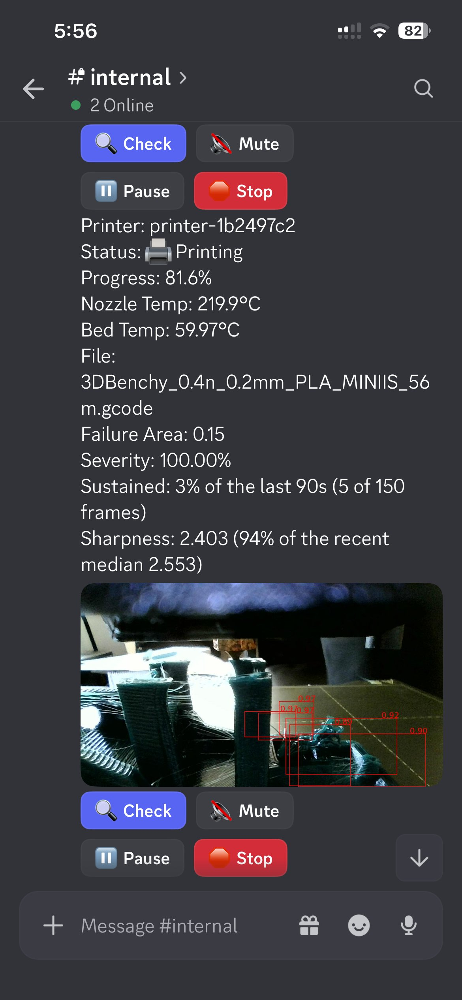

# PiNozCam for Moonraker

<p align="center">
  
  
</p>

Local AI print-failure detection for Klipper. It watches the print through
your existing camera, and when the print starts to fail it tells you --
optionally pausing or stopping the printer.

**The detection runs on the printer's own board.** No account, no
subscription, and no frame is uploaded for the AI to look at -- it keeps
detecting with the internet unplugged. That is the whole point of it: the
alternative products in this space upload every frame to a server and charge
a monthly fee.

⚠️ The optional Telegram and Discord alerts are the exception, and worth
being precise about: those **are** cloud services, so an alert's photo does
travel to their servers, and both platforms retain messages indefinitely by
default. It is the only thing that leaves your network, it happens only if
you configure it, and detection itself never depends on it. See
[Remote access](docs/REMOTE_ACCESS.md).

> **Under development.** The detector, the notifications and the web view
> are working and have been verified on real hardware, but this has not yet
> been tested against a wide range of printers and cameras. Treat
> "Alert only" as the sensible starting configuration.

This is the Klipper/Moonraker port of
[OctoPrint-PiNozCam](https://github.com/DrAlexLiu/OctoPrint-PiNozCam). The
model, the inference runtime and every detection setting are the same, so a
printer moved between the two behaves identically.

---

## What it does

- **Detects failures locally.** A ResNet-50 detector scores each frame; a
  frame counts as alarming when the detected area is large enough and the
  model is confident enough.
- **Judges over a window, not a frame.** One bad frame is a reflection or a
  hand reaching in. It acts when a *fraction* of the last N seconds alarms
  -- a fraction rather than a count, so the same setting means the same
  thing on a slow board and a fast one.
- **Uses the NPU when there is one.** Rockchip RK3566/3576/3588, Allwinner
  A733/T527, Ascend, Horizon and Apple silicon all have native runners;
  otherwise it runs on the CPU.
- **Tells you on Telegram or Discord**, with the annotated photo and buttons
  to check the camera, mute, pause or stop.
- **Shows an annotated live view**, and registers it with Moonraker so it
  turns up in Mainsail and Fluidd's own camera list.

## Requirements

- Klipper with Moonraker (any recent version; nothing is patched)
- A camera Moonraker knows about -- crowsnest/ustreamer is the usual setup
- Python 3.8+
- 64-bit userspace on ARM, or x86_64

## Install

```bash
cd ~
git clone https://github.com/DrAlexLiu/moonraker-pinozcam.git
cd moonraker-pinozcam
./install.sh
```

The installer finds `printer_data` by asking Moonraker's own service file
where it points, creates a virtualenv, installs the inference runtime for
the board it is running on -- including the NPU library where the board
image ships the kernel driver without it -- writes
`moonraker-pinozcam.cfg` if it is not already there, registers with
Moonraker's update manager, and starts a systemd service.

It is safe to re-run: an existing config is never overwritten, and
`moonraker.conf` is only appended to if the section is not in it yet. It
does not touch Klipper or your printer configuration.

Removing it is one command, and it puts everything back:

```bash
./uninstall.sh
```

## Using it

Once the service is running there are three ways in, and you do not need
all of them.

### The web page

`http://<printer>:58888`

The live view with detection boxes drawn on it, the current failure ratio
against the threshold you set, and dialogs for the settings and for the
undetect zone. It is the same layout as the OctoPrint plugin's tab.

> **By default this page has no login and answers anyone who can reach the
> printer.** A saved bot token is never sent back to it -- the field shows
> eight dots and a badge saying one is stored -- but the field IS writable,
> so without a password anyone who can reach the port can replace your
> token, your camera URL and your failure action.
>
> Set one and the page and the whole settings API ask for it:
>
> ```
> ~/moonraker-pinozcam-env/bin/python -m moonraker_pinozcam \
>     -c ~/printer_data/config/moonraker-pinozcam.cfg --set-password
> ```
>
> It applies at once, with no restart. Snapshots and the stream stay open
> so PiNozCam keeps working in Mainsail's camera list -- Mainsail renders a
> webcam as a plain `` carrying no credentials, and your host already
> serves that same picture without a login on port 80. ⚠️ There is no TLS
> here: a password stops someone browsing to the port, not someone who can
> watch the traffic. Do not port-forward this port, or
> Moonraker's, to the public internet; see
> [docs/REMOTE_ACCESS.md](docs/REMOTE_ACCESS.md) for what to do instead.

### Mainsail and Fluidd

PiNozCam registers itself as a webcam with Moonraker, so the annotated view
appears in the frontend's camera list next to your ordinary camera. Nothing
has to be installed into Mainsail or Fluidd, and neither of them has a
third-party plugin mechanism to install into.

### Telegram and Discord

Set the credentials in the config file and the bot will send the annotated
frame when a failure is confirmed, with buttons on the message:

| button | what it does |
|---|---|
| **Check** | replies with a fresh photo and the printer's status -- works between prints too |
| **Mute** / **Unmute** | stops alerts without stopping detection |
| **Pause** / **Resume** | pauses the print, after a confirmation |
| **Stop** | cancels the print, after a confirmation |

Typed commands work as well: `/hi` on Telegram, `!check` on Discord.

| Telegram | Discord |
|---|---|
|  |  |

Pause and Stop ask before acting, and the confirmation is single-use,
expires, and is refused if the print ended while it was waiting.

## Settings

Everything is in `~/printer_data/config/moonraker-pinozcam.cfg`, which
Mainsail and Fluidd can edit in the browser under **Machine →
Configuration Files** -- no SSH needed. The file is commented, and those
comments are the documentation.

The ones that matter most:

| setting | default | what it means |
|---|---|---|
| `scores_threshold` | `0.87` | how confident the model must be |
| `img_sensitivity` | `0.04` | how much of the frame a failure must cover |
| `failure_ratio` | `0.05` | fraction of the window that must alarm before acting |
| `count_time` | `120` | length of that window, in seconds |
| `action` | `0` | 0 alert only, 1 pause, 2 stop |
| `cpu_share` | `0.75` | share of the performance cores the detector may use |

The web page's sensitivity slider sets the first three together, in five
steps from Strictest to Loosest, exactly as the OctoPrint build does.

> `cpu_share` is the **one** deliberate difference from the OctoPrint
> build, which defaults it to 0.5. OctoPrint streams gcode line by line, so
> a stalled host marks the print. Klipper computes a step schedule and
> pushes about a second of it to the MCU ahead of time, which absorbs host
> stalls -- measured on a CB2 under full saturation, Klipper's serial
> threads were kept off the CPU for 0.5 ms out of 15 s. The reasoning is
> written out in [docs/ARCHITECTURE.md](docs/ARCHITECTURE.md).

## The undetect zone

Some parts of the picture are never the print: the bed's edge, a logo, the
spot where the head parks. Paint over them in the web page's zone editor
and the detector ignores them -- the mask is applied *before* inference, so
those pixels cost nothing and cannot raise a score.

## Speed

Measured end to end, camera fetch through post-processing:

| board | backend | per check |
|---|---|---|
| RK3588 (LubanCat-4) | NPU, 3 cores | 96 ms |
| RK3576 (ROCK 4D) | NPU, 2 cores | 165 ms |
| RK3566 (BIQU CB2, Orange Pi 3B) | NPU, 1 core | ~270 ms |
| Allwinner T527 | NPU | 125 ms |
| Pi 4 / CM4 (A72) | CPU, 4 cores | ~2.6 s |
| Allwinner H616 (Sovol SV08) | CPU, 4 cores | ~4 s |

A print monitor glances every few seconds, so even the slowest row here is
comfortably faster than it needs to be.

## Does it slow the printer down?

No. Klipper pushes roughly a second of step schedule to the MCU ahead of
time, so a busy host does not reach the motors. Measured on a CB2 with the
detector saturating every core, Klipper's serial threads waited **0.5 ms
across 15 seconds** -- four orders of magnitude inside that buffer. This is
structurally different from OctoPrint, where the host streams gcode line by
line and a stall does show up in the print.

## Documentation

**Using it**

- [Camera setup](docs/camera.md) -- where to point it, what PiNozCam
  accepts, and how the live view works
- [Detection logic and tuning](docs/detection-and-tuning.md) -- exactly how
  it decides a print is failing, and how to change that
- [Telegram and Discord](docs/notifications.md) -- setting up the bots and
  what the buttons do
- [Performance](docs/performance.md) -- how fast each board is, and how many
  cores to give it

**Hardware**

- [Rockchip NPU](docs/rockchip-npu.md) -- RK3566 / RK3576 / RK3588
- [Allwinner NPU](docs/allwinner-npu.md) -- A733 / T527

**Reference**

- [Architecture](docs/ARCHITECTURE.md) -- how the pieces fit, and why each
  of them is shaped the way it is
- [Remote access](docs/REMOTE_ACCESS.md) -- watching the printer from
  outside the house, and why this project does not open a tunnel for you
- [Licences](docs/licenses.md) -- what ships from where, and the LGPL
  source offer for the statically linked daemon

Most of these are ported from the OctoPrint build's own docs. The model, the
daemon and every detection setting are shared, so the text is upstream's
wherever it still applies; each file says at the top what was changed for
Klipper and why.

## Credits and licence

The detection model, the inference runtimes and the native runners are
shared with [OctoPrint-PiNozCam](https://github.com/DrAlexLiu/OctoPrint-PiNozCam)
and built from the same sources.

Licensed under the AGPL-3.0. See [LICENSE](LICENSE).
