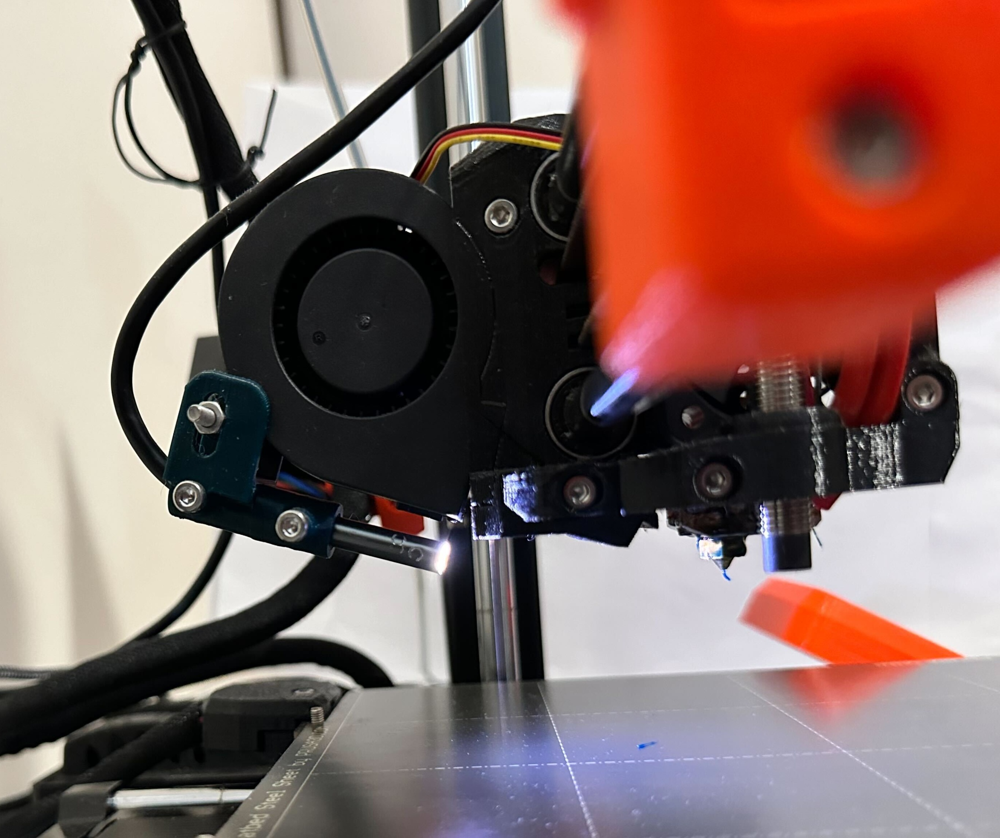
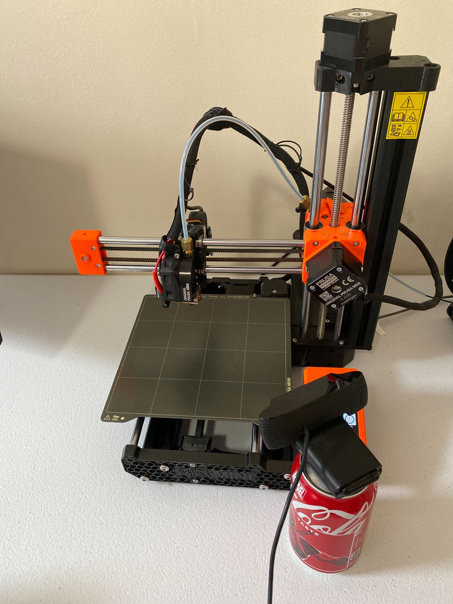

# Camera setup guide

[← Back to README](../README.md)

PiNozCam uses the camera your Klipper host already has. This guide covers
choosing a camera position, checking the image, where the camera is found,
and how the live view works.

> Ported from the OctoPrint build's guide of the same name. The physical
> advice is unchanged -- same model, same working resolution. What is
> rewritten is where the camera comes from, because Klipper's answer is
> Moonraker and crowsnest rather than OctoPrint's webcam stack.

## Choose a view

| Nozzle camera | Overview camera |
|---|---|
| Mount close to the nozzle so small extrusion problems fill more of the frame. | Mount where the current layer and the printed part remain visible throughout the job. On an enclosed printer this is the position usually called a chamber camera. |
|  |  |

## Installation checklist

1. Fix the camera rigidly. Vibration and autofocus hunting reduce usable
   sharpness more than extra resolution helps.
2. Aim a nozzle camera roughly 5–10 cm from the nozzle, or place an overview
   camera far enough away to keep the complete print area visible.
3. Use even lighting. Avoid a bright lamp reflected directly into the lens.
4. Prefer at least 480p and a stable frame rate. A 16:9 view best matches the
   current calibration set, but 4:3 and portrait inputs are letterboxed rather
   than stretched.
5. Focus on the extrusion/print surface, not the background. Disable autofocus
   if it repeatedly refocuses while the toolhead moves.
6. Clean the lens and check that cables, bed clips, and the toolhead do not
   cover the important area.
7. Configure the camera in Mainsail or Fluidd (**Settings → Webcams**),
   then open `http://<printer>:58888` and check the picture there. Press
   **Test**. If using a different IP camera, enter its snapshot or MJPEG URL.
8. Start with **Alert only**. Draw Undetect Zones over fixed objects that
   produce boxes.

## Where the camera is found

Leave `snapshot_url` empty under `[camera]` and PiNozCam looks in three
places, in this order, stopping at the first that answers:

1. **`snapshot_url` in the config file** — set it only to override the rest.
2. **Moonraker's webcam list** — what you configured in Mainsail or Fluidd.
   This is the one to use: it also carries the rotation and flip you set
   there, so the detector and the frontend agree about which way up the
   picture is. ⚠️ PiNozCam registers its own annotated view as a webcam,
   and skips that entry here — otherwise it would feed itself its own
   output.
3. **`/webcam/` on the printer's own nginx** — the stock Klipper path,
   for a camera that is plainly working but was never added in the
   frontend. The log says so, and suggests adding it.

⚠️ **Setting `snapshot_url` costs you two things**, so prefer leaving it
empty: the rotation/flip from Mainsail no longer apply, and the page's
**Live Camera** button disappears, because PiNozCam can no longer promise
that the stream shows the same camera the detector watches.

A custom source may be:

```text
http://camera/webcam/?action=stream     # MJPEG stream
http://camera/webcam/?action=snapshot   # JPEG snapshot
file:///home/pi/test.jpg                # local test image
```

- **MJPEG stream:** best for crowsnest/ustreamer or an IP camera.
- **HTTP snapshot:** works with cameras that provide one JPEG per request.
- **Local file:** useful for installation checks and repeatable testing.

PiNozCam follows the flip and rotation Moonraker reports for that webcam,
keeps the image's aspect ratio, and correctly maps detection boxes back onto
the displayed camera image.

RTSP is not supported as a direct AI source. HLS and WebRTC URLs are not
parsed by the MJPEG reader.

## Live view

The page at `http://<printer>:58888` shows the frame the model analysed, and
fetches a new one only when the analysis moves on. Between prints it shows
the plain camera.

**Live Camera** (the film-camera button) points your browser straight at the
printer's own stream for fluid video at its native frame rate — PiNozCam is
not in the path at all, so watching costs the printer nothing. Boxes are
deliberately not drawn over it: a live frame is not the frame that produced
the AI result.

The button is hidden whenever the stream might not show what the detector
sees — a `snapshot_url` is set, the camera has no stream, rotation is
configured, or the URL is HLS/WebRTC, which an `` cannot display.

⚠️ **One difference from the OctoPrint build**: there, boxes are drawn in
your browser on a canvas. Here they are drawn into the JPEG on the printer,
because PiNozCam also registers this view as a webcam so it appears in
Mainsail's camera list — and Mainsail renders it as a plain image that
cannot draw anything of its own.
